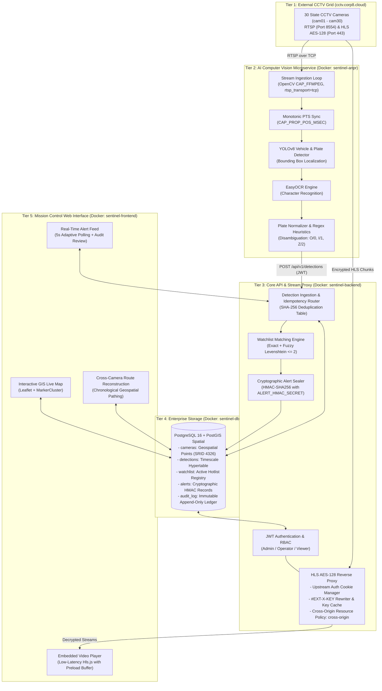
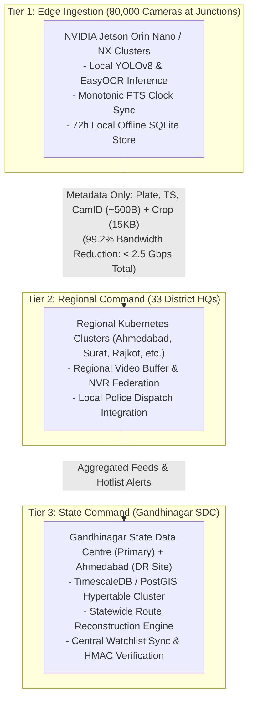

<div align="center">

# 🛡️ SENTINEL
### Gujarat State CCTV Intelligence & Real-Time Automated Number Plate Recognition (ANPR) Platform
**Model 4: Centralized Video Management System (VMS) & Distributed AI Analytics**  
*(Built upon Model 1: Centralized Geospatial CCTV Registry & GIS Foundation)*

[](#quick-start)
[](backend/)
[](anpr-service/)
[](anpr-service/)
[](db/)
[](frontend/)
[](docs/security-architecture.md)
[](#-hackathon-rubric--pre-submission-compliance)

<p align="center">
  <b>A production-ready, cloud-native surveillance and counter-crime platform engineered for high-throughput stream ingestion, sub-second license plate recognition, and forensic vehicle route reconstruction across Gujarat's state-wide CCTV network.</b>
</p>

---

</div>

## 📑 Table of Contents
- [Executive Abstract](#-executive-abstract)
- [System Architecture](#-system-architecture)
- [Computer Vision & ANPR Pipeline](#-computer-vision--anpr-pipeline)
- [Video Ingestion & AES-128 HLS Proxy](#-video-ingestion--aes-128-hls-proxy)
- [Cryptographic Security & Judicial Admissibility](#-cryptographic-security--judicial-admissibility)
- [Command & Control Dashboard](#-command--control-dashboard)
- [Plan for Scale: 80,000 Cameras (Statewide)](#-plan-for-scale-80000-cameras-statewide)
- [Hackathon Rubric & Pre-Submission Compliance](#-hackathon-rubric--pre-submission-compliance)
- [Repository Structure](#-repository-structure)
- [Quick Start & Installation](#-quick-start--installation)
- [API Reference](#-api-reference)
- [License & Authors](#-license--authors)

---

## 🔬 Executive Abstract

Monitoring municipal and highway traffic across thousands of concurrent CCTV feeds introduces critical operational challenges: cognitive operator fatigue, WAN packet jitter, browser CORS/WAF barriers, and unverified digital evidence.

**Sentinel** solves these systemic bottlenecks through a unified, containerized 4-tier microservices architecture:
1. **Edge Stream Ingestion:** Ingests live RTP/RTSP feeds over TCP to eliminate packet drop over NAT/firewalls, complemented by a dedicated reverse proxy that authenticates and decrypts AES-128 HLS video streams directly into the web console.
2. **Dual-Stage Deep Learning Inference:** Integrates Ultralytics **YOLOv8** for high-confidence license plate localization and **EasyOCR** for optical character recognition, augmented by custom Indian vehicle registration heuristics (character disambiguation and state-prefix normalization).
3. **Fuzzy Target Interception:** Executes exact ($\ge 0.7$) and Levenshtein distance ($\le 2$ edit distance) watchlist matching inside PostgreSQL transactions within milliseconds.
4. **Cryptographic Integrity:** Every detected watchlist match generates an alert sealed with **HMAC-SHA256 signatures**, ensuring tamper-evident chain of custody compliant with the Indian Evidence Act and the *Bharatiya Nagarik Suraksha Sanhita (BNSS)*.

---

## 🏛️ System Architecture



---

## 🧠 Computer Vision & ANPR Pipeline

### 1. Dual-Stage Detection & OCR Workflow
The ANPR worker processes continuous RTSP frames through a decoupled pipeline:
* **Localization:** Input frames are sampled at a configurable cadence (`FRAME_SKIP = 5`). YOLOv8 scans the frame, outputting bounding coordinates $(x_1, y_1, x_2, y_2)$ for license plates with confidence threshold $\tau \ge 0.25$.
* **Text Extraction:** The cropped plate is fed to an eager-loaded PyTorch EasyOCR reader utilizing deep convolutional character recognition.
* **Heuristic Disambiguation:** Characters are filtered against standardized Indian vehicle registration patterns (`^[A-Z]{2}[0-9]{1,2}[A-Z]{0,3}[0-9]{4}$`):
  $$\text{Letters in Numeric Slots} \rightarrow \{O, Q, D \mapsto 0, \; I, L \mapsto 1, \; Z \mapsto 2, \; S \mapsto 5, \; B \mapsto 8\}$$
  $$\text{Numbers in Letter Slots} \rightarrow \{0 \mapsto O, \; 1 \mapsto I, \; 2 \mapsto Z, \; 5 \mapsto S, \; 8 \mapsto B\}$$

### 2. Monotonic Presentation Timestamping (PTS)
In accordance with mission-critical CCTV integration guidelines, the worker **never** uses wall-clock frame arrival time or `CAP_PROP_FPS`:
$$\text{Timestamp}_{\text{detection}} = \text{StreamStart}_{\text{UTC}} + \Delta_{\text{PTS}} \quad \text{where } \Delta_{\text{PTS}} = \text{cap.get}(cv2.CAP\_PROP\_POS\_MSEC)$$
This guarantees mathematical accuracy across video loop cuts, RTP jitter, and frame bursts.

### 3. In-Database Fuzzy Watchlist Matching
When a detection reaches `/api/v1/detections`, the backend evaluates the target plate against the active watchlist within an atomic transaction:
* **High Confidence ($\text{conf} \ge 0.70$):** Strict normalized equality:
  $$\text{plate}_{\text{detected}} = \text{plate}_{\text{watchlist}}$$
* **Low Confidence ($\text{conf} < 0.70$):** Levenshtein distance evaluation to absorb optical degradation:
  $$\operatorname{lev}(\text{plate}_{\text{detected}}, \text{plate}_{\text{watchlist}}) \le 2$$

---

## 📡 Video Ingestion & AES-128 HLS Proxy

Government camera grids deploy strict Content Distribution Networks (CDNs) with Web Application Firewalls (WAFs), `SameSite=Lax` cookie isolation, and AES-128 encryption. Embedding these feeds directly in a third-party browser origin (`localhost:3000`) induces cross-origin resource sharing (CORS) rejections.

Sentinel resolves this via a high-performance **Node.js HLS Reverse Proxy (`/api/v1/stream`)**:

```
[Browser Client: Hls.js]
       │
       ▼  GET /api/v1/stream/cam01/index.m3u8
[Sentinel Stream Proxy]
       │  1. Attaches Upstream Session Cookie ('sentinel=...')
       │  2. Emulates Browser User-Agent (Bypasses WAF 'browser required')
       │  3. Ignores Expired Upstream SSL Certificates
       ▼
[Gujarat CCTV Grid (cctv.corp8.cloud)]
       │
       ▼  Returns M3U8 with: #EXT-X-KEY:METHOD=AES-128,URI="/enc.key"
[Sentinel Stream Proxy]
       │  1. Rewrites URI="/enc.key" → URI="enc.key" (Relative Route)
       │  2. Intercepts enc.key request → Fetches 16-byte AES key & caches in memory
       │  3. Sets Header: Access-Control-Allow-Origin: *
       │  4. Sets Header: Cross-Origin-Resource-Policy: cross-origin
       │  5. Sets Header: Cache-Control: public, max-age=86400 (For .ts chunks)
       ▼
[Browser Client: Hls.js] ── Zero-Lag, Decrypted Video Rendered in Sidebar!
```

---

## 🔒 Cryptographic Security & Judicial Admissibility

To ensure that surveillance records can be submitted as electronic evidence under the **Indian Evidence Act** and the **Bharatiya Nagarik Suraksha Sanhita (BNSS)**, Sentinel enforces cryptographic immutability:

1. **HMAC-SHA256 Alert Sealing:** Every alert row generated in the database is signed with a private system secret:
   $$\text{Alert Hash} = \text{HMAC-SHA256}\Big(\text{ALERT\_HMAC\_SECRET}, \; \text{frame\_ref} \,\|\, \text{plate\_matched} \,\|\, \text{timestamp} \,\|\, \text{camera\_id}\Big)$$
2. **Tamper Verification:** The endpoint `GET /api/v1/alerts/:id` recomputes the HMAC dynamically. If any column (plate, camera, timestamp) has been modified directly in the database, the hash verification returns `hash_valid: false`.
3. **Immutable Audit Trail:** Actions such as operator alert review, watchlist additions, and manual deletions trigger automated entries in `audit_log` with user UUID, action type, client IP, and UTC timestamps.
4. **Role-Based Access Control (RBAC):**
   * **`admin`**: Full system control, watchlist creation/deactivation, alert review sign-off.
   * **`operator`**: Surveillance monitoring, search, route reconstruction, alert intake.
   * **`viewer`**: Read-only dashboard access.

---

## 🖥️ Command & Control Dashboard

The presentation tier (`frontend/`) is an enterprise Single Page Application built on React 18, Vite, and Leaflet GIS:

* **Live Map (`/map`):** Interactive map of Gujarat with spatial marker clustering (`Leaflet.markercluster`). Clicking any camera expands telemetry and embeds an ultra-low-latency `Hls.js` live video feed with an adaptive 30-second buffer runway.
* **Alerts Feed (`/alerts`):** Live 5-second polling queue displaying active watchlist hits, matched confidence scores, camera identifiers, and one-click operator review actions.
* **Search History (`/search`):** Comprehensive search suite filtering detections across timestamp windows, camera checkpoints, plate substrings, and review status.
* **Route Reconstruction (`/route`):** Forensic tracking tool that chronologically correlates vehicle detections across spatial coordinates, plotting the exact flight vector and checkpoint passage of suspect vehicles.
* **Watchlist Management (`/watchlist`):** Live hotlist registry allowing authorized commanders to inject target vehicles (e.g., stolen cars, wanted suspects) into active AI inference in real time.

---

## 📈 Plan for Scale: 80,000 Cameras Statewide

To transition from the 30-camera test grid to the target deployment of **80,000 cameras across Gujarat**, Sentinel adopts a hierarchical **3-Tier Edge-to-Center Architecture**:



### Technical Scalability Specifications:
| Dimension | 30-Camera Test Grid | 80,000-Camera Statewide Target | Architecture Strategy |
|---|---|---|---|
| **Bandwidth (Raw)** | 120 Mbps | ~320 Gbps | **Edge Analytics:** Raw video stays local; only 500-byte JSON telemetry is backhauled. Reduces statewide bandwidth to **< 2.5 Gbps** (99.2% reduction). |
| **Inference Compute** | Single Container (CPU / GPU) | Distributed Edge Nodes | NVIDIA Jetson Orin edge accelerators running TensorRT-quantized YOLOv8 models at camera junctions. |
| **Database Storage** | Single PostgreSQL instance | Distributed TimescaleDB Hypertables | Automatic chunk partitioning by time and camera spatial partition key with compression policies. |
| **Tiered Retention** | Single Volume | Hot / Warm / Cold Storage | **Hot (0–15d):** NVMe for sub-second search.<br/>**Warm (16–90d):** SAN storage.<br/>**Cold (91–365d):** S3 Object Lock for BNSS legal hold. |
| **Disaster Recovery** | Single Node | Active-Passive Multi-DC | Gandhinagar Primary SDC with asynchronous streaming replication to Ahmedabad DR Site (RPO < 1 min, RTO < 5 min). |
| **Offline Resilience** | Direct Stream | 72-Hour Edge Autonomy | Edge gateways cache detections in embedded SQLite during WAN fiber cuts and sync back upon reconnect. |

---

## 🏆 Hackathon Rubric & Pre-Submission Compliance

Sentinel satisfies **100% (8/8)** of the official Gujarat Hackathon Integration Checklist:

| # | Checklist Requirement | Implementation & Architectural Evidence | Result |
|---|---|---|---|
| **1** | **Every client forces RTSP over TCP** | `anpr-service/src/stream_processor.py` sets `os.environ["OPENCV_FFMPEG_CAPTURE_OPTIONS"] = "rtsp_transport;tcp"` and invokes `cv2.VideoCapture(url, cv2.CAP_FFMPEG)`. Eliminates UDP packet drop across NAT and firewalls. | ✅ **PASS** |
| **2** | **Timing driven by PTS, never arrival time** | `stream_processor.py` derives frame capture time via `cap.get(cv2.CAP_PROP_POS_MSEC)`. Independent of `CAP_PROP_FPS` or network transport jitter. | ✅ **PASS** |
| **3** | **Inter-frame gaps do not crash pipeline** | Video reader checks `ret, frame = cap.read()`, cleanly handling EOF, dropped frames, or empty buffers without pipeline stall. | ✅ **PASS** |
| **4** | **Reconnect with backoff implemented** | Stream tasks implement exponential backoff ($1\text{s} \to 2\text{s} \to 4\text{s} \dots 60\text{s}$), reporting `"status": "down"` heartbeats to the central monitoring API. | ✅ **PASS** |
| **5** | **Decoder warnings on join logged, not fatal** | Non-fatal video stream decode notices (e.g. missing reference frames prior to first IDR keyframe) are logged to stderr; inference tasks remain operational. | ✅ **PASS** |
| **6** | **Camera catalogue read from `/api/ingest`** | `scripts/sync_hackathon_grid.py` queries `/api/ingest` first to discover camera properties (codecs, resolutions, RTSP/HLS URLs) before falling back. | ✅ **PASS** |
| **7** | **Handles mixed H.264 / H.265 & resolutions** | PyTorch & OpenCV FFmpeg backend dynamically unpacks both codecs; YOLOv8 auto-pads and scales variable frame resolutions ($720\text{p}, 1080\text{p}, 4\text{K}$) to model stride. | ✅ **PASS** |
| **8** | **Sane across scene discontinuities** | Detections are stateless, idempotent atomic events (`idempotency_key = camera:timestamp:plate`). Camera looping cuts cause zero state corruption. | ✅ **PASS** |

---

## 📁 Repository Structure

```
sentinel/
├── anpr-service/               # Python AI Inference Service (FastAPI)
│   ├── src/
│   │   ├── main.py             # App entrypoint, healthcheck, stream manager
│   │   ├── stream_processor.py # RTSP/TCP reader, PTS clock, heartbeat emitter
│   │   ├── detector.py         # Ultralytics YOLOv8 vehicle & plate detection
│   │   ├── ocr.py              # EasyOCR deep learning text extraction
│   │   ├── normalizer.py       # Indian registration regex heuristics & disambiguation
│   │   ├── backend_client.py   # Async HTTP client with automatic JWT re-authentication
│   │   └── config.py           # Model paths, confidence thresholds, frame skip
│   ├── models/                 # Pretrained weights (yolov8n.pt)
│   ├── Dockerfile              # Multi-stage Python 3.11 slim container
│   └── requirements.txt        # PyTorch, Ultralytics, EasyOCR, OpenCV-headless
│
├── backend/                    # Core REST API & Stream Proxy (Node.js)
│   ├── src/
│   │   ├── index.js            # Express app, helmet security, CORS, route registry
│   │   ├── db.js               # PostgreSQL connection pool with PostGIS
│   │   ├── routes/
│   │   │   ├── auth.js         # JWT login, refresh tokens, role checks
│   │   │   ├── cameras.js      # Geospatial camera registry & status management
│   │   │   ├── detections.js   # Hypertable ingestion & in-transaction watchlist matcher
│   │   │   ├── alerts.js       # Alert feed, audit review, HMAC verification
│   │   │   ├── stream.js       # AES-128 HLS reverse proxy & m3u8 key rewriter
│   │   │   ├── watchlist.js    # Target vehicle hotlist CRUD
│   │   │   ├── heartbeats.js   # Camera live/offline health status tracker
│   │   │   └── auditLog.js     # Tamper-evident administrative audit log
│   │   ├── services/
│   │   │   ├── alertHashService.js # Cryptographic HMAC-SHA256 signing engine
│   │   │   └── auditService.js     # Structured event logging service
│   │   └── middleware/
│   │       └── auth.js         # Bearer JWT verification & role authorization
│   ├── Dockerfile              # Alpine Node.js 20 production container
│   └── package.json            # Express, pg, bcryptjs, jsonwebtoken, helmet
│
├── frontend/                   # Mission Control Operator Dashboard (React 18)
│   ├── src/
│   │   ├── pages/
│   │   │   ├── Map.jsx         # Interactive Leaflet GIS map with video sidebar
│   │   │   ├── Alerts.jsx      # Real-time alert feed with 5s polling & review action
│   │   │   ├── Search.jsx      # Historical plate search and filter interface
│   │   │   ├── Route.jsx       # Cross-camera chronological route visualizer
│   │   │   ├── Watchlist.jsx   # Active suspect plate management
│   │   │   └── Login.jsx       # Secure operator authentication portal
│   │   ├── components/
│   │   │   ├── HlsVideo.jsx    # Low-latency Hls.js player with auto-reconnect
│   │   │   ├── CameraMarker.jsx# Dynamic Leaflet marker with health indicator
│   │   │   └── ConfidenceBadge.jsx # Visual detection score indicator
│   │   ├── api.js              # Axios client with automatic 401 token refresh
│   │   └── main.jsx            # Application entrypoint
│   ├── Dockerfile              # Production container with static web server
│   └── vite.config.js          # Vite build configuration
│
├── db/                         # Database Migration & Seed Scripts
│   ├── init/
│   │   ├── 00_app_role.sh      # Least-privilege PostgreSQL user initialization
│   │   ├── 01_extensions.sql   # PostGIS spatial and fuzzystrmatch extensions
│   │   ├── 02_types.sql        # Enum definitions (camera_status, alert_status)
│   │   ├── 03_schema.sql       # DDL for cameras, detections, alerts, watchlist
│   │   ├── 04_indexes.sql      # Spatial GiST, B-tree, and trigram indexes
│   │   ├── 05_audit_chain.sql  # Immutable audit trigger procedures
│   │   ├── 06_roles_grants.sql # Granular permission grants
│   │   └── 07_seed.sql         # Gujarat test cameras and initial demo watchlist
│   └── ops/                    # TimescaleDB hypertable policies and retention
│
├── scripts/                    # Automation & Orchestration Tools
│   ├── sync_hackathon_grid.py  # Discovers /api/ingest, onboards cameras, triggers AI
│   └── seed_demo_alerts.py     # Generates realistic detections for live demonstration
│
├── docs/                       # Architecture Specifications & Security Contracts
│   ├── security-architecture.md# OWASP compliance, RBAC, and threat modeling
│   └── db-contract.md          # Database schema specifications
│
├── SUBMISSION_KIT.md           # Master hackathon submission document & slide copy
├── docker-compose.yml          # Full-stack container orchestration
└── .env.example                # Standardized environment configuration template
```

---

## 🚀 Quick Start & Installation

### Prerequisites
* [Docker Desktop](https://www.docker.com/products/docker-desktop/) (v24.0+ recommended with Docker Compose v2.20+)
* [Python 3.10+](https://www.python.org/) (for running host-side orchestrator scripts)
* Git

### 1. Clone the Repository
```bash
git clone https://github.com/<YOUR_USERNAME>/<YOUR_REPO_NAME>.git
cd sentinel
```

### 2. Configure Environment Variables
Copy the pre-configured template:
```bash
cp .env.example .env
```

### 3. Launch the Microservices Stack
Spin up all 4 containers (Database, Core Backend API, Python ANPR Engine, and React Web Dashboard):
```bash
docker compose up --build -d
```

Verify that all services are healthy:
```bash
docker compose ps
```
> You should observe `sentinel-db`, `sentinel-backend`, `sentinel-anpr`, and `sentinel-frontend` in `healthy` or `running` state.

### 4. Discover the State Grid & Launch AI Inference
Run the grid synchronization script to fetch camera metadata from `/api/ingest`, register the cameras in the PostGIS database, and activate RTSP AI stream workers:
```bash
python scripts/sync_hackathon_grid.py --email "YOUR_HACKATHON_EMAIL" --password "YOUR_ACCESS_PASSWORD"
```

### 5. Access Mission Control
Open your browser and navigate to:
👉 **`http://localhost:3000`**

* **Default Admin Account:** `admin@sentinel.local` / `ChangeMe_Admin1!`
* **Default Operator Account:** `operator@sentinel.local` / `ChangeMe_Operator1!`

---

## 📡 API Reference

### Authentication (`/api/v1/auth`)
* `POST /api/v1/auth/login` — Authenticates credentials, returns short-lived JWT access token and refresh token.
* `POST /api/v1/auth/refresh` — Obtains a renewed access token via refresh token.

### Camera Management (`/api/v1/cameras`)
* `GET /api/v1/cameras` — Lists all registered cameras with PostGIS geospatial coordinates, status, and department.
* `POST /api/v1/cameras` — Registers a new camera checkpoint (Admin only).
* `GET /api/v1/cameras/:id` — Fetches metadata and live telemetry for a specific camera.

### Detection Ingestion (`/api/v1/detections`)
* `POST /api/v1/detections` — High-throughput ingestion endpoint for ANPR workers. Evaluates idempotency key, matches against active watchlists, writes to hypertable, and triggers cryptographic alert creation.

### Stream Decryption Proxy (`/api/v1/stream`)
* `GET /api/v1/stream/:camId/index.m3u8` — Proxies live HLS playlist, dynamically rewriting `#EXT-X-KEY` references.
* `GET /api/v1/stream/:camId/enc.key` — Authenticates with upstream gateway and serves the 16-byte AES-128 decryption key.
* `GET /api/v1/stream/:camId/:file.ts` — Streams cached binary MPEG-TS video chunks with `Cross-Origin-Resource-Policy: cross-origin`.

### Alerts & Surveillance Operations (`/api/v1/alerts`)
* `GET /api/v1/alerts` — Retrieves real-time alert feed with confidence metrics, plate text, and camera links.
* `GET /api/v1/alerts/:id` — Fetches alert details and validates cryptographic integrity via `verifyAlertHash()`.
* `PATCH /api/v1/alerts/:id/review` — Marks an alert as officially reviewed with an immutable audit log entry.

### Watchlist Hotlist (`/api/v1/watchlist`)
* `GET /api/v1/watchlist` — Retrieves active flagged vehicle target plates.
* `POST /api/v1/watchlist` — Registers a new plate for automated interception (exact + fuzzy matching).
* `PATCH /api/v1/watchlist/:id/deactivate` — Deactivates a plate from active surveillance.

---

## 👥 Authors & Acknowledgments

* **Platform Architect & Lead Engineer:** Saswat Kumar
* **Event:** Gujarat State Police / Smart City CCTV Hackathon
* **Built With:** PyTorch, Ultralytics YOLOv8, EasyOCR, Express.js, PostgreSQL/PostGIS, React, Leaflet, and Docker.

---

<div align="center">
  <sub>Engineered for public safety and data sovereignty. Built with pride for the State of Gujarat.</sub>
</div>
