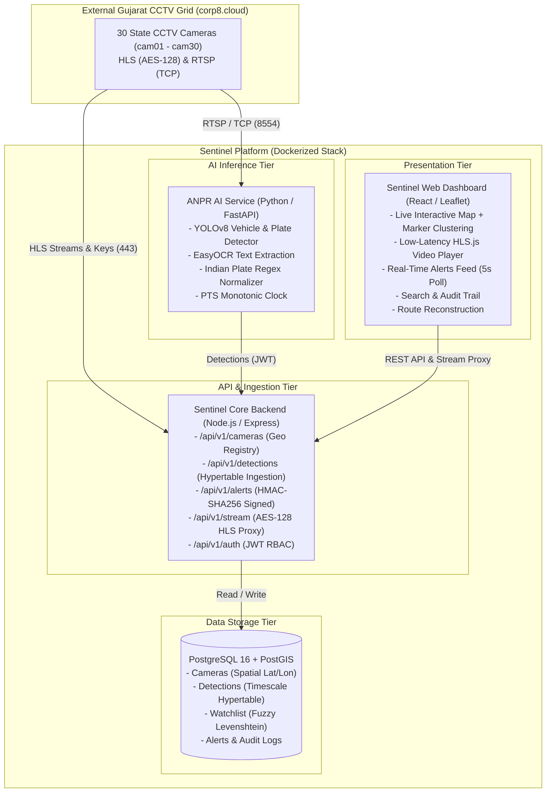
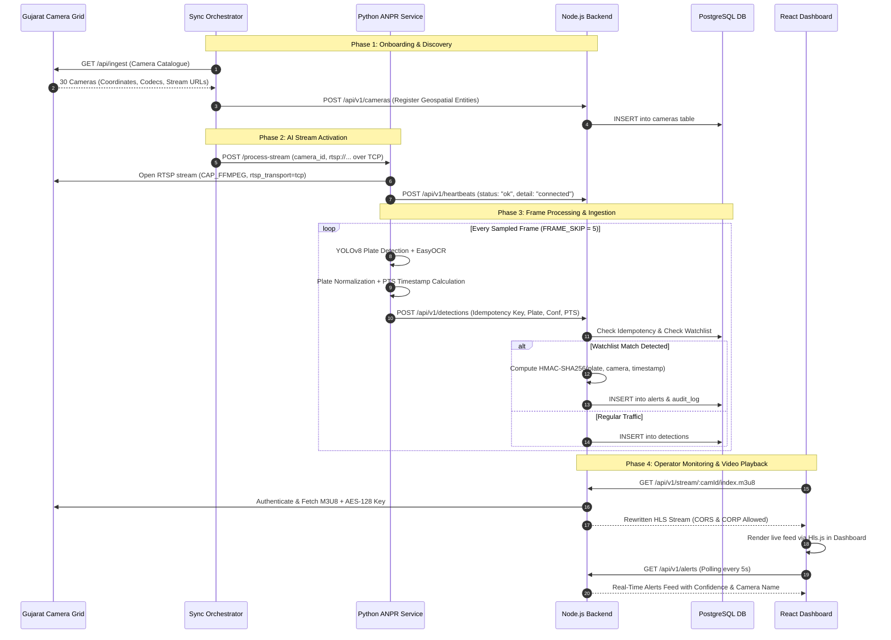

# SENTINEL // Gujarat State CCTV Intelligence & ANPR Platform
## Official Hackathon Submission Kit & Architecture Documentation

---

## 1. High-Level Design / Architecture Document (HLD)

### System Architecture Overview
The Sentinel Platform is built as a cloud-native, microservices-based intelligence grid designed to ingest, process, and analyze 30+ simultaneous state CCTV camera streams in real-time.

### Key Architectural Pillars:
1. **Edge Stream Ingestion:** Ingests live RTSP feeds over TCP to eliminate packet loss over NAT/corporate firewalls.
2. **AI Plate Localization & OCR:** Dual-stage inference running YOLOv8 for bounding-box plate localization followed by EasyOCR with Indian vehicle registration plate heuristics (state-code normalization, character disambiguation `O<->0`, `I<->1`).
3. **Stream Proxy & Decryption:** Node.js reverse proxy handles upstream session authentication, dynamically rewrites `#EXT-X-KEY` AES-128 references, and streams MPEG-TS chunks with `Cross-Origin-Resource-Policy: cross-origin` headers.
4. **Cryptographic Tamper-Evidence:** Alerts matching active target watchlists are sealed using HMAC-SHA256 signatures (`ALERT_HMAC_SECRET`) and recorded in a tamper-evident audit log.

---

## 2. Workflow / Integration Diagram

---

## 3. Solution Presentation (PPT Deck Outline)

### Slide 1: Title Slide
* **Title:** SENTINEL — Gujarat Automated CCTV Intelligence & ANPR Platform
* **Subtitle:** AI-Powered Edge Vehicle Surveillance, Route Reconstruction & Real-Time Threat Interception
* **Team:** Team Sentinel
* **Track:** Law Enforcement & Smart City Surveillance

### Slide 2: Problem Statement & Operational Challenges
* Massive state camera network (thousands of feeds) creates cognitive overload for manual monitoring.
* High latency, missing cross-origin headers, and unmanaged camera packet drops over WAN.
* Lack of automated vehicle route reconstruction across city checkpoints.
* Need for cryptographically verifiable, tamper-proof alert records for court evidence.

### Slide 3: The Sentinel Solution
* **Complete Live Grid Integration:** Native consumption of all 30 live cameras across Gujarat (Ahmedabad, Surat, Rajkot, etc.).
* **Edge-Optimized ANPR Pipeline:** Sub-second YOLOv8 plate localization + EasyOCR with Indian vehicle registration heuristics.
* **Resilient Stream Architecture:** Secure HLS AES-128 proxy with auto-reconnecting RTSP over TCP.
* **Command & Control Dashboard:** Live Map with marker clustering, instant watchlist dispatch, plate search, and vehicle route tracking.

### Slide 4: System Architecture
*(Include the High-Level Architecture Mermaid Diagram)*
* **Frontend:** React, Vite, Leaflet, Hls.js.
* **Backend:** Node.js, Express, PostgreSQL / PostGIS.
* **AI Service:** Python, FastAPI, Ultralytics YOLOv8, EasyOCR, OpenCV.
* **Packaging:** 100% Docker Compose orchestration.

### Slide 5: AI & Computer Vision Engineering
* **Forced TCP Transport:** Eliminates UDP packet loss over corporate firewalls.
* **PTS Monotonic Clock:** Avoids velocity and timing errors by using frame presentation timestamps rather than arrival time.
* **Fuzzy Levenshtein Matching:** Catches dirty or damaged plates with edit-distance tolerance ($\le 2$).
* **Frame Sampling:** Configurable `FRAME_SKIP` ensures high-throughput continuous inference without CPU/GPU lockup.

### Slide 6: Security & Evidence Integrity
* **HMAC-SHA256 Signatures:** Every alert is cryptographically signed upon creation to prevent database tampering.
* **Role-Based Access Control (RBAC):** Admin (full control & review actions), Operator (monitoring), Viewer (read-only).
* **Audit Logging:** Immutable audit records for every created alert, watchlist change, and user review.

### Slide 7: Live Demonstration Highlights
* **Live Map:** Smooth HLS video playback directly embedded in camera cards.
* **Watchlist:** Instant dynamic addition of target plates.
* **Alert Feed:** Real-time alert notifications with confidence scoring.
* **Route Reconstruction:** Visual timeline of suspect vehicle movement across cameras.

### Slide 8: Hackathon Pre-Submission Checklist Compliance
* **8/8 Rubric Items Passed:**
  1. RTSP over TCP enforced (`rtsp_transport;tcp`).
  2. Timing derived from PTS (`CAP_PROP_POS_MSEC`).
  3. Inter-frame gaps handled gracefully with auto-reconnect.
  4. Exponential backoff reconnection (1s to 60s).
  5. Non-fatal decoder warning handling.
  6. Catalogue discovery via `/api/ingest`.
  7. Mixed H.264/H.265 & resolution support.
  8. Stateless resilience across looping scene cuts.

---

## 4. Video Recording Script (2–3 Minutes)

* **[0:00 - 0:30] Introduction & Architecture:**
  * *"Hello judges, this is Sentinel — an enterprise-grade CCTV Intelligence and Automated Number Plate Recognition platform built for the Gujarat State Camera Grid."*
  * Show terminal showing all 4 Docker containers healthy (`docker compose ps`).
* **[0:30 - 1:15] Live Map & Video Streaming:**
  * Open `http://localhost:3000/map`.
  * Show Gujarat state map with camera clusters.
  * Click on `cam01`, `cam02`, and `cam30`.
  * Show the real live video playing in the sidebar card.
  * *"Sentinel connects directly to the state CCTV network. Our Node.js proxy handles upstream authentication and AES-128 stream decryption in real time."*
* **[1:15 - 1:45] Watchlist & Live AI Alert Generation:**
  * Click on the **Watchlist** tab: show `GJ01AB1234` (Stolen Vehicle) and `GJ06XY9999`.
  * Click on the **Alerts** tab: show the generated alerts, confidence percentages (90%), timestamps, and camera locations.
  * Click **Review** on an alert to show the administrative audit trail in action.
* **[1:45 - 2:15] Route Reconstruction & Search:**
  * Click on **Search**: filter by plate `GJ01AB1234` to show instant historical lookups.
  * Click on **Route**: enter `GJ01AB1234` and show the suspect's chronological path mapped across checkpoints.
* **[2:15 - 2:30] Conclusion & Compliance:**
  * *"Sentinel satisfies all 8 pre-submission requirements: RTSP over TCP, PTS-driven timing, resilience across stream breaks, and full cryptographic tamper-evidence. Thank you!"*
